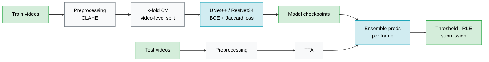

# Mitral Valve Segmentation in Echocardiography


Segmentation of the mitral valve (MV) in 2D echocardiography videos using a UNet-based deep learning pipeline. This project was developed as part of the Advanced Machine Learning course at ETH Zürich (2025).

---

## Task

The mitral valve regulates blood flow between the left atrium and left ventricle. Accurate segmentation from echocardiography is a critical step for automated diagnosis and surgical planning of MV diseases.

**Setup:** 65 training videos (3 labeled frames each, from both expert and amateur annotators) + 20 unlabeled test videos. The task is to produce a per-frame binary segmentation mask for every frame in each test video.

**Evaluation:** Median Jaccard Index (IoU) over all test videos.

---

## Pipeline



---

## Approach

### Training

The pipeline uses a **UNet++** architecture with a **ResNet34** encoder pretrained on ImageNet, implemented via [`segmentation-models-pytorch`](https://github.com/qubvel/segmentation_models.pytorch). Grayscale frames are replicated to 3 channels and resized to 256×256. UNet++'s nested skip connections improve feature fusion for small structures like the mitral valve.

Training uses **stratified 5-fold cross-validation**, split at the video level to prevent data leakage from correlated consecutive frames. Each fold trains for 20 epochs (batch size 8, AdamW, lr=1e-4, cosine annealing schedule). The best checkpoint per fold (by validation IoU) is saved, yielding 5 models.

**Loss:** BCE with logits (`pos_weight=10` to handle class imbalance, as the MV occupies ~0.7% of pixels) + Jaccard loss weighted at 0.75, directly optimizing the evaluation metric.

**Augmentation:** horizontal/vertical flips, ±30° rotation, brightness/contrast jitter (disabled during validation).

### Inference

Each test frame is evaluated using **Test-Time Augmentation** across 4 geometric variants (original, horizontal flip, vertical flip, both), passed through all 5 trained models — 20 predictions per frame in total. Outputs are averaged after inverse transformations, then binarized at a threshold of 0.5 and encoded with Run-Length Encoding for submission.

Inference uses MPS acceleration on macOS with CPU fallback.

---

## Repository Structure

```
├── src/                # Final submitted pipeline
├── experiments/        # Alternative architectures and inference strategies explored
├── data_analysis/      # Exploratory and diagnostic scripts
├── task3.ipynb         # RLE helpers provided by the course
└── pyproject.toml
```

---

## Setup

```bash
# Install dependencies (requires uv)
uv sync

# Or with pip
pip install segmentation-models-pytorch albumentations torch torchvision
```

### Download Data

```bash
kaggle competitions download \
    --file sample.csv \
    --file test.pkl \
    --file train.pkl \
    --path ./data \
    eth-aml-2025-project-task-2
```

### Train

```bash
python src/train.py
```

### Inference

```bash
python src/inference_tta.py
```

---

## Pretrained Weights

Model weights are not tracked in this repository due to file size. They are available on Google Drive:

[Download weights](https://drive.google.com/drive/folders/1tngkPJ9xUZxxsLmEOyMR9W1tGV4pbhin)

Place the `.pth` files in a `models/` directory at the root of the project before running inference.

---

## Notes

- The `data/` directory is excluded from version control — download via the Kaggle command above.
- `task3.ipynb` provides the official RLE encoding/decoding helpers required for the Kaggle submission format.
- Alternative training approaches are in `experiments/`, exploratory scripts in `data_analysis/`.
